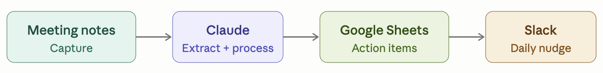

# Chief of Staff — Build Log

An agentic chief of staff built with Claude Code, Google Sheets, Slack, and Granola. Built across 6 sessions as part of the Women Defining AI cohort.

## Why I built this

I had scattered notes everywhere — Apple Notes, Granola, Google Docs — with no reliable system for surfacing action items or follow-ups. Things got captured but not completed. LinkedIn content ideas were buried in the same pile. I was doing all the context-holding myself.

The chief of staff is my attempt to offload that. It runs on a schedule, proactively surfaces what matters, and gets out of the way. The core design principle: **push, not pull** — the system comes to me, I don't go looking for it.

## What it does

- **Daily nudge** — every morning, scans my action item tracker and brain dump channel, then posts a structured summary to Slack with priority tables, anomaly flags, and a 2-3 sentence analysis
- **Brain dump processing** — anything I post to a dedicated Slack channel gets routed: tasks → action items, ideas → content ideas, notes → saved for later
- **Meeting processing** — post `process [meeting name]` in Slack and it pulls the Granola transcript, extracts action items, flags content-worthy moments, and posts a summary
- **Command processing** — post `done AI-007` or `mark AI-003 in progress` in Slack and it updates the tracker automatically

## Architecture

| Tool | Role |
|------|------|
| Claude Code | The brain — reads, reasons, writes |
| Google Sheets | Persistent action item store (Action Items tab + Content Ideas tab) |
| Granola | Meeting notes source |
| Slack | Delivery channel (nudges, summaries) + input (brain dump, commands) |
| Google Apps Script | Webhook for all Sheet writes |
| launchd | Automated scheduling on macOS |

**Data flow:**
- **In:** Granola (meetings) + Slack #brain-dump (everything else)
- **Store:** Google Sheet
- **Out:** Slack #cos-updates (nudges, summaries) + Google Calendar (deadline events)

## What's built (v1)

- Daily nudge with structured format — per-goal tables, 🔴🟡🟢 priority, ⚠️ anomaly flags, analysis summary
- Brain dump routing with content type detection (action item vs. content idea vs. observation)
- Meeting processing via Slack command (`process [meeting name]`)
- Slack command processor — handles status updates, new items, content idea updates
- Apps Script webhook — append rows, update AI- items, update CI- items, add content ideas
- Bot identity — posts as Chief of Staff APP, not my personal Slack profile
- Automated via launchd — nudge fires on two triggers: login-triggered LaunchAgent (fires on restart) and sleepwatcher LaunchDaemon (fires on wake from sleep). A once-per-day guard is shared between both triggers — whichever fires first wins, the other skips. Command processor runs at noon / 4pm via StartCalendarInterval. If Mac is asleep at those times, that run is skipped; items are processed on next trigger. Nothing is lost permanently.

## What's next (v2)

- Meeting processing automation (no manual trigger)
- Meeting filter by Granola folder
- Evals framework — scoring nudge quality, extraction accuracy, content idea hit rate
- Weekly content scan + progress snapshot
- Meeting processing confirmation step — AIs require approval, CIs auto-written as Draft

## Files in this repo

- `CLAUDE.md` — the system prompt / operating instructions for the CoS. This is what Claude reads at the start of every session to understand goals, tools, and how to behave.
- `daily-nudge.sh` — shell script triggered on login (RunAtLoad). Runs the command processor first, then reads the Sheet and posts the nudge. Once-per-day guard prevents re-firing on re-login.
- `process-commands.sh` — shell script run by launchd at noon and 4pm (StartCalendarInterval). Also called synchronously by the nudge at login so brain-dump is processed before the Sheet is read.
- `chief-of-staff-brief.md` — full project brief: architecture decisions, roadmap, and lessons learned.

## Build log

Session-by-session decisions, tradeoffs, and failures are maintained separately outside this repo. The failures are documented intentionally — this is a build-in-public project and the mistakes are part of the story.

